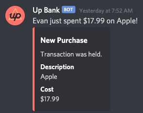

# UpBank Webhook Ingester

An AWS Lambda function to ingest UpBank payloads and forwards them to Discord, ~~so that my friends can laugh at me~~

Feel free to use this yourself or reuse the type definitions.



## Important clarification

This was hacked together in like an hour or two for fun, please don't judge _too_ hard.

This Lambda function relies on the default environment variable encryption to store the Up API token, which isn't entirely recommended.

## How to install

Warning: this uses AWS Lambda.

1. Install [Serverless](https://www.serverless.com/framework/docs/getting-started/).
2. POST to `https://api.up.com.au/api/v1/webhooks with this body:
```json
{
	"data": {
		"attributes": {
			"url": "https://my-shitty-host.com"
		}
	}
}
```
Where `url` is the endpoint for your Lambda function.

3. Create a config.json in the root code directory and replace the comments with your appropriate values:

```json
{
    "DISCORD_WEBHOOK_ID": "/* Webhook ID for a channel specific webhook (second-last path component of the webhook URL) */",
    "DISCORD_WEBHOOK_TOKEN": "/* Webhook token (last path component of the webhook URL) */",
    "UP_ACCOUNT_HOLDER": "/* The name to use for Discord messages */",
    "UP_AUTH_TOKEN": "/* Up Bank API Personal Token */",
    "UP_WEBHOOK_SECRET": "/* Up Bank Webhook Secret retrieved from the API upon webhook creation */"
}
```
4. Run `npm run deploy`. You may need to update the profile and region in the `serverless.yml` config or add `--region [aws region] --aws-profile [profile]` to the end of the deploy script in `package.json`.
5. Test with a ping and by transferring some money from your savings account to spending
6. Lose all self esteem
